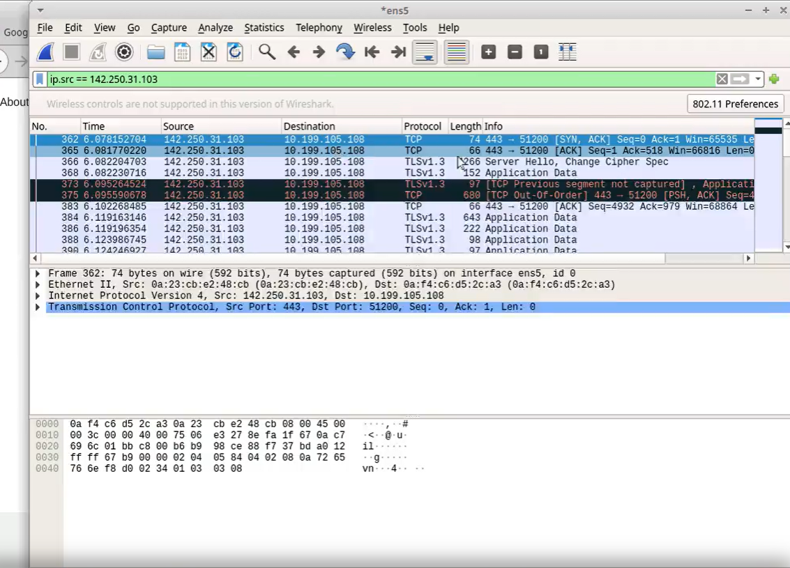

# WireShark Project From Coursera
## Project Objective

<li>Install and set up Wireshark on Ubuntu.</li>

<li>Start a packet capture on an ethernet port and save it to file.</li>

<li>Use a display filter to detect HTTPS packets.</li>

<li>Practice Task: Start a Wireshark capture and detect HTTP packets.</li>

<li>Visit a web page and detect its IP address using a display filter.</li>

<li>Locate all HTTPS packets from a capture not containing a certain IP address.</li>

<li>Capstone Task: Use Wireshark to capture and observe ethernet packets on HTTP and HTTPS ports.</li>

## Task 1
● Install and set up Wireshark on Ubuntu:

● To get the latest stable version of Wireshark on Ubuntu Linux, use the add-apt-repository command: sudo add-apt-repository ppa:wireshark-dev/stable

● Wireshark should not be run as superuser for security reasons.

● The user can be added to the Wireshark group to add packet capture capabilities: sudo usermod -aG wireshark $USER

## Task 2

### Start a packet capture on an ethernet port and save it to file:

●The wired interface includes the ethernet packet capture, which begins with ‘en’ in Wireshark.

●The Wireshark app includes controls to start packet capture, stop capture, save the packets to a file, and load the capture file.

●A capture can only be saved once the capture has stopped.

## Task 3

### Use a display filter to detect HTTPS packets:

●To display certain packets in an existing packet capture, use a display filter.

●To display only HTTPS traffic, use a filter on TCP port 443: tcp.port == 443

## Task 4
### Visit a web page and detect its IP address using a display filter:

●A TLS handshake display filter may be used to detect a website visit in a packet list: tls.handshake.type ==1

●The IP address is used in a filter to obtain packet information for a particular website: ip.addr == 142.251.163.105

## Task 5

### Locate all HTTPS packets from a capture not containing a certain IP address:

●A Conditional statement may be used to include and eliminate packets from a Wireshark capture: !(ip.addr == 8.43.85.97) and tcp.port == 443

●A compound conditional should include parentheses to avoid order of execution errors: !(ip.addr == 8.43.85.97) and (tcp.port == 80 or tcp.port == 443)

<a href="https://github.com/SalaiSwetha/Microsoft-Windows-Defender-and-Firewall-.git"> **Back to Main Page** </a>

